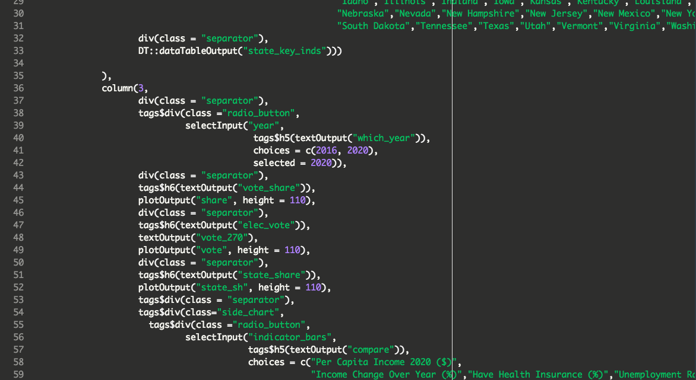
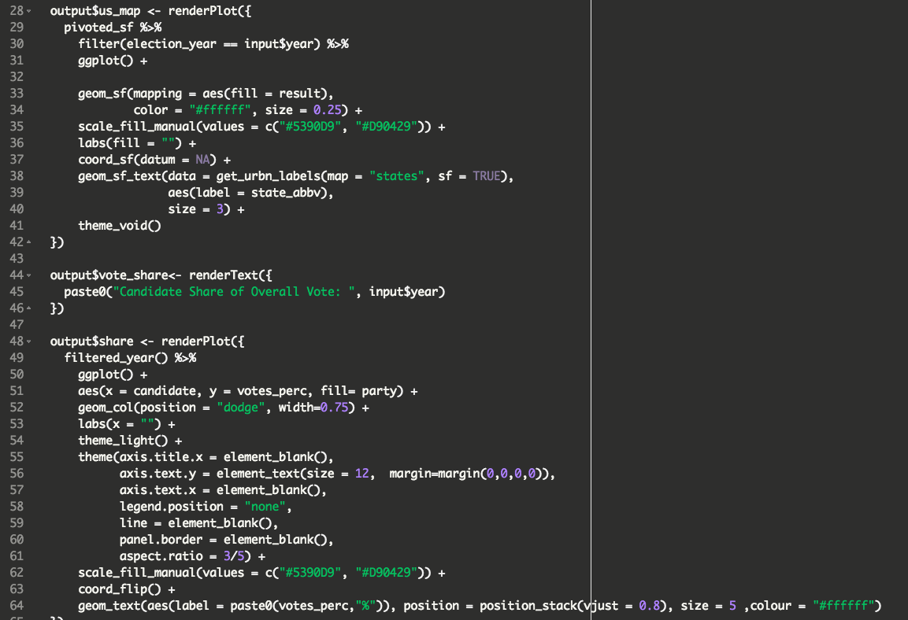
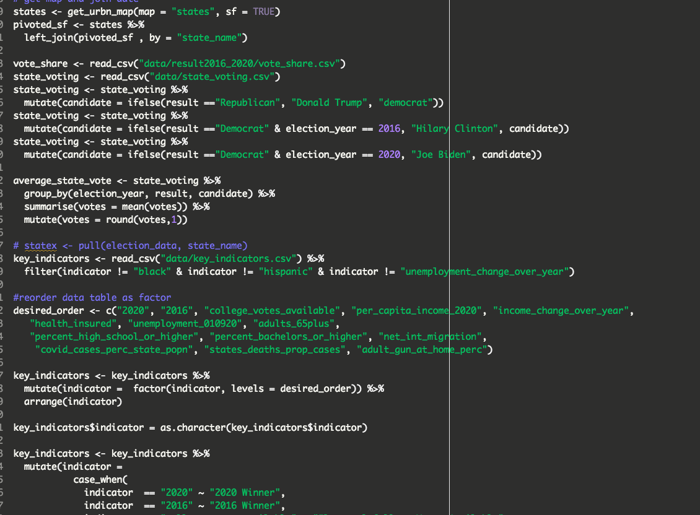
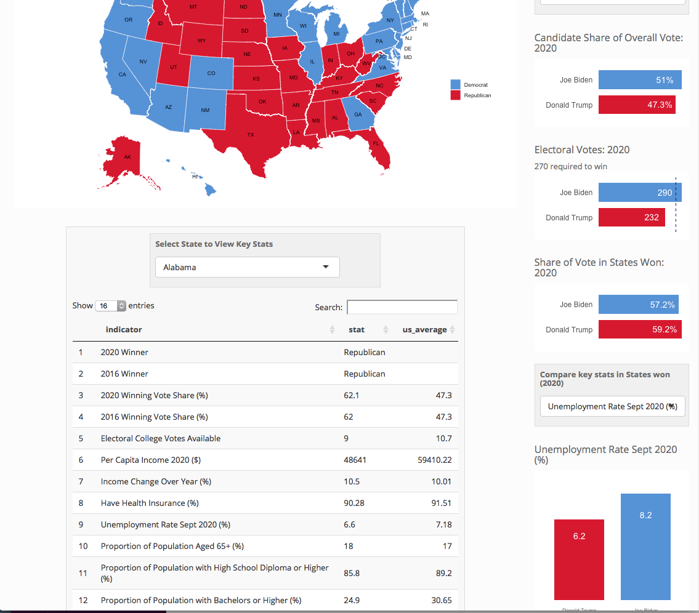
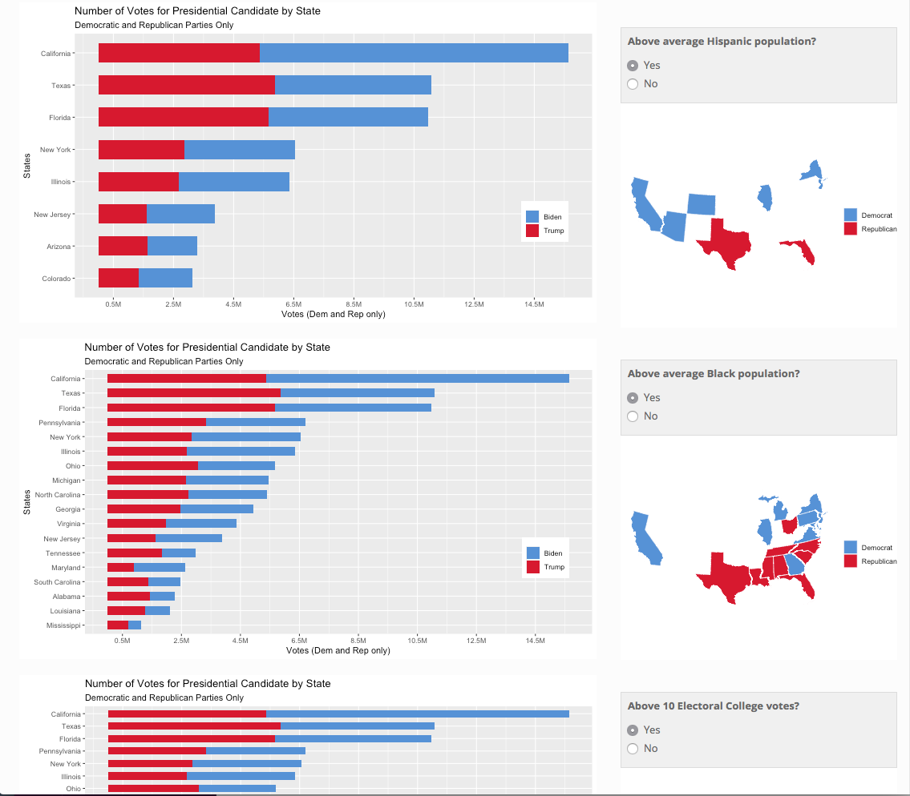
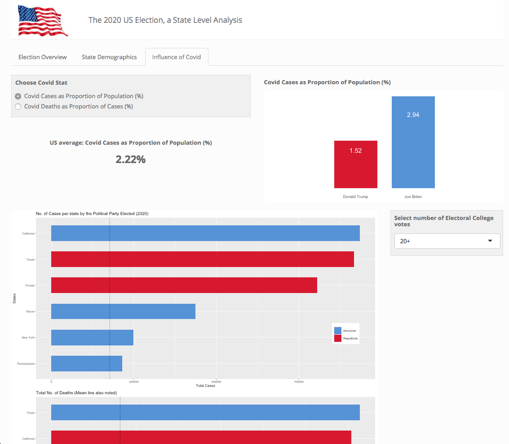

# US Election Data Analysis App

### 6 Day Group Project 

I got together with 2 others who had been on the CodeClan Data Analysis to build a Data Analysis project from scratch.

###### Process
In our initial meeting ( via Zoom) we discussed options for projects, and as the US 2020 Election had just happened in the last week we decided that this would be an excellent subjsct area to explore.
We discusssed how we would visualize the data and decided to build an R Shiny App, built form the ground level with no templates.  We created a visual and a written plan and a timeline of what needed to be done when.
We then discussed what we hoped to achieve and the key indicators / data that we needed to do this.  
Because of the election being so recent there was not data avaialable on specific demographics of the election so we decided to focus on the demographics of the US State and how the State voted.
We then pulled data from various reputable sources ( US Census, US Govt Bureaus, National Surveys) and compiled one data set which we could all work from.  This involved
multiple left joins, pivoting and wrangling of the data to get it in to the format we required.
We then worked to create the structure and skeleton of our Shiny App with designates sections for each of our code.
We agreed who would focus on which subject areas, each of us taking a tab on the app.

We maintained close contact throughout our project, working around each of our own busy schedules to support eachother, debug eachother's code and maintain consistency in the design.

###### Personal code example 1
ui.R

###### Personal code example 2
server.R

###### Personal code example 3 
global.R

###### App ScreenShot 1
Wrangling and Plotting with Seaborn

###### App ScreenShot 2

###### App ScreenShot 3

